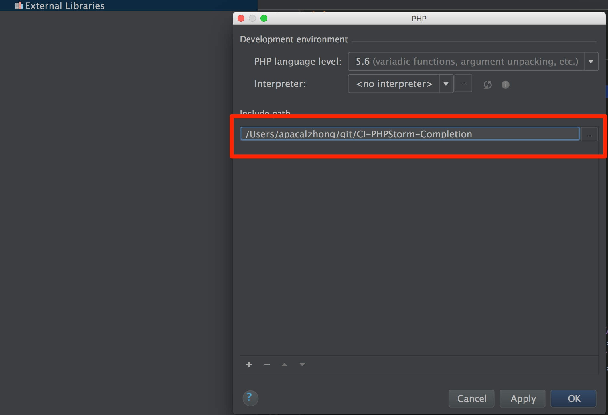

# phpstorm ci补全

Original project : [https://github.com/topdown/phpStorm-CC-Helpers](https://github.com/topdown/phpStorm-CC-Helpers)

CodeIgniter source: [https://github.com/bcit-ci/CodeIgniter](https://github.com/bcit-ci/CodeIgniter)

## Installation instructions

### First method

Set an include path

In the project explorer, right click on External Libraries then select Configure PHP Include Paths. Add the path to the CI-PHPStorm-Code-Completion/PHPStorm_CI_CC directory and apply.

Warning!
CI-PHPStorm-Completion/system/core/Controller.php
CI-PHPStorm-Completion/system/core/Model.php
has been remove

### Second method

Warning!

Make your libraries available to code completion

Add your libraries to the documentation block corresponding (available for all 3 methods) :

***************** YOUR LIBRARIES *****************
* @property Layout              $layout               Layout Class
Remark: if you have to use those libraries in controllers only, just set them as class property for CI_Controller. Same applies for models with CI_Model.

Make your models available to code completion

Add your models to the documentation block corresponding (available for all 3 methods) :

***************** YOUR MODELS *****************
* @property user_model          $user_model           ,$user
* @property data_model          $data_model
* @property products_model      $products_model
* @property movie_model         $movie_model
Remark: it's useless to set your models as class property of CI_Model cause you don't want to use MVC like that :)
